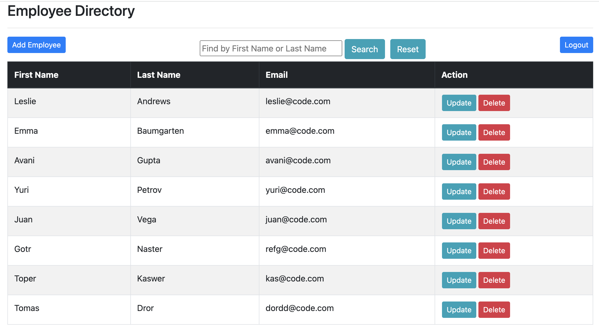
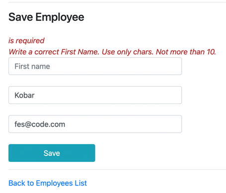
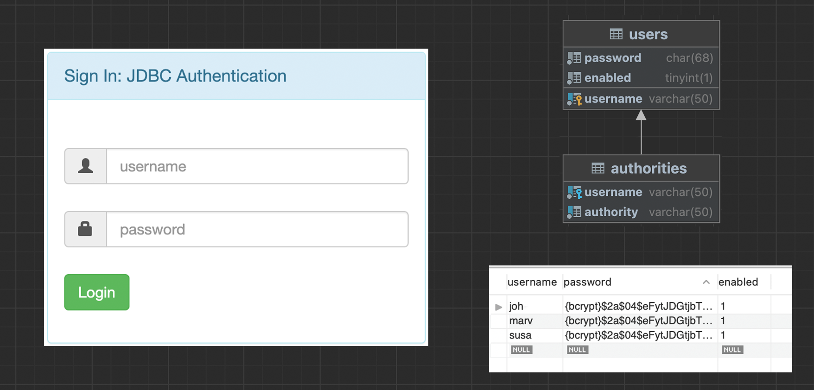
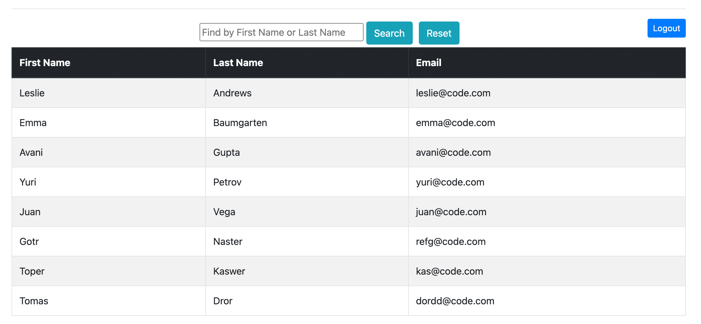
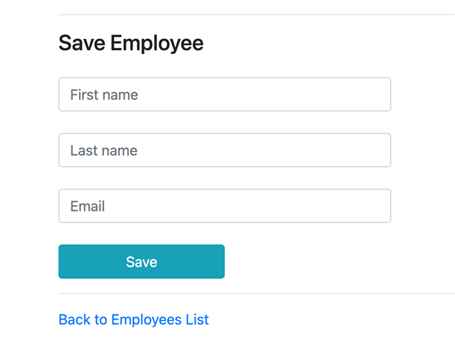

# Spring Web Project  Thymeleaf

ㅤWorked on the creation of a web-CRM program that accepts the data of new employees and records their data in our database. On the working page, we have the opportunity to see all existing users, we can also add new users using a separate button. In the table we have two active buttons Update and Delete. We can also search for users by First Name or Last Name. The reset button returns us to view the full table of all employees.

ㅤBriefly about the project, created through Spring Boot, used annotations and classes for configurations. Thymeleaf is used for html files. To connect to the database, we use Spring Boot JpaRepository, in which additional methods were created. Our program is synchronized with the MySQL database.

There is also a Validation API that we use when filling out information about new employees and updating information.

ㅤTo perform access control, we use Spring Security, which we configure via @Bean SecurityFilterChain. Names, passwords for access are stored in tables in a separate database. I used bcrypt to protect passwords.
When you log in for the first time, we perform an access check. Full functionality is available only to Admin, Manager can only add new employees and update information about them. Our Employee can only view the table.

## What the EMPLOYEE page looks like

When filling out the form, we keep the following data:
- Name;
- Last name;
- Email;

